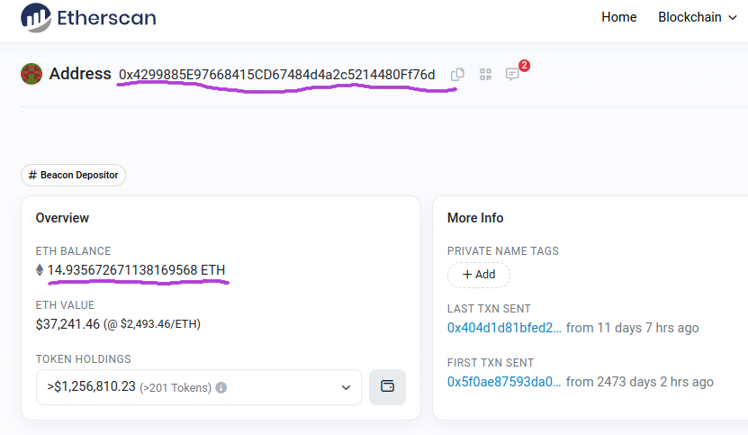

ipi для доступа к нодам блокчейнов: https://app.infura.io/

Получить эфир для тестовой сети sepolia: https://www.infura.io/faucet/sepolia

установка и запуск локальной сети эфириум с помощью ganache:
```shell
sudo npm install -g ganache-cli
ganache-cli
```



компиляция смарт-контракта todo.sol:
```shell
solc --bin --abi contract/todo.sol -o build
```
сгенерировать код todo.go, который будет взаимодействовать с развёрнутом в сети смарт-контрактом:
```shell
abigen --bin=build/Todo.bin --abi=build/Todo.abi --pkg=todo --out=gen/todo.go
```